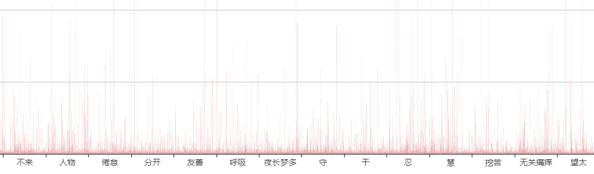
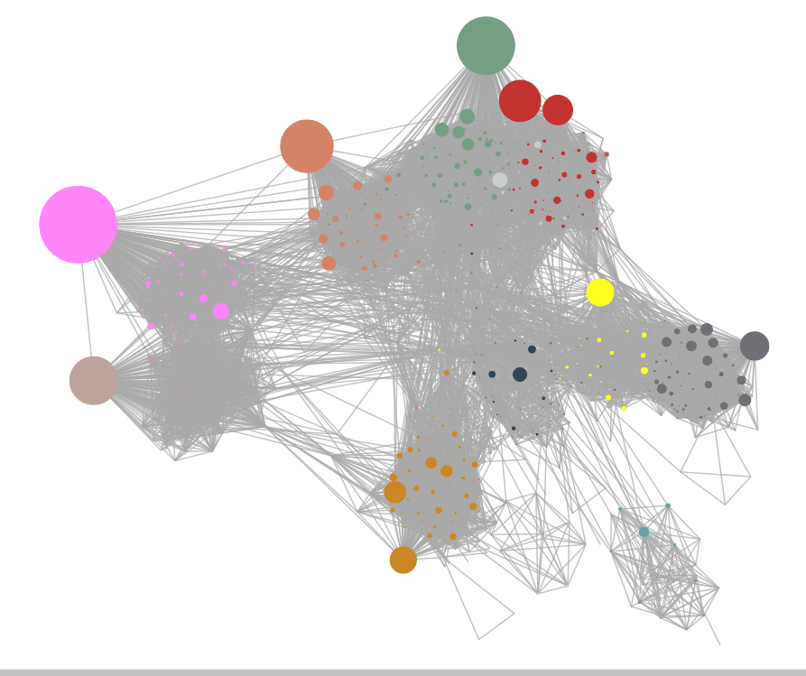

# BigData
利用Spring搭建基于Hadoop的大数据分析

## 完成部分
   - MapReduce
       - 分析金庸小说中出现的人物和他们之间的关系
       - 源数据：全本的金庸武侠小说文集
       - MapReduce实现
           - 人名提取 NameSplit （基于Ansj_seg）
           - 人物出现次数统计 NameCount
           - 人物同现统计 BuildRelationshipMap （不对关系做过多分析，认为同一段落的人物即存在关系）
           - 人物关系图构建 BuildRelationshipMap
           - 基于人物关系图的PageRank计算
                - PR值初始化 GraphBuilder
                - 迭代计算PR值 PageRankIter
                - 对PR值进行排序 PageRankViewer
           - 基于人物关系图的标签传播
                - 标签初始化 LPAInit
                - 迭代更新标签 LPAIteration
                - 按标签进行分区，并根据PR值进行排序 LPAReorganize
       - 歌词分析
       - 源数据：通过QQ音乐爬取歌词(./others/LrcCrawler.py)
       - MapReduce实现
           - 词语计数 WordCount
           - 词语计数排序 WordCloud
           
   - 通过网站对HDFS中的文件进行管理
   
   - 使用charts.js完成mapreduce结果的可视化
        - 词语计数
        
        - 生成词云 （此处为林夕歌词）
        
        - 生成关系图 （此处为金庸全部小说的人物关系聚类）
        
